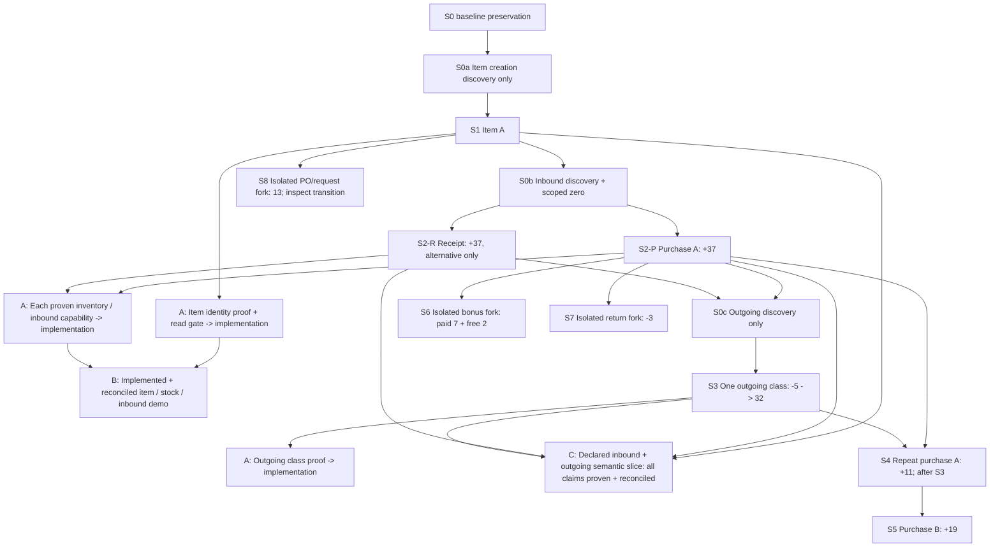

# Controlled Motakamel Dataset #001 — Design Only

Date: 2026-09-10

Pilot: #001 — Purchase Attention + Item Intelligence

Environment: `DBL-MotakamelPlus-Lab` only

Next action: **BASELINE PRESERVATION -> S0a ITEM-ONLY DISCOVERY**. Readiness is tracked per capability; no execution or implementation is authorized by this document revision.

This document retains nine scenarios, S0–S8, and their controlled quantities. S0 separates baseline preservation from just-in-time discovery stages S0a/S0b/S0c; these are not new business scenarios. Item identity can reach its implementation gate after S1; inventory and inbound capabilities can follow after their own proof, normally from S2. S3 extends the evidence to one supported outgoing inventory movement class only and is NOT required before the first Motakamel-specific production code. S2 has two mutually exclusive routes, not two transactions. S4–S8 remain optional extensions. No scenario has been executed by this task, and no new semantic mapping is LAB-PROVEN yet.

## 1. Objective and authority

Create the fewest official Motakamel transactions that establish an identifiable item, a known quantity in a known unit/location, an identifiable inbound event and a subsequent outgoing event. Where the official inbound workflow proves a purchase and supplier relationship, retain those additional facts. Use this evidence to authorize only the connector slice it actually supports.

Evidence sequence:

`Predeclared UI action and expected result -> bounded before evidence -> official action -> bounded after evidence -> mapping hypothesis -> independent Motakamel reconciliation -> scoped confidence decision`

Qualification levels remain separate:

- **LAB-PROVEN:** controlled official transactions reconcile with structured source evidence in the exact educational profile.
- **PARTNER-VALIDATED:** those mappings survive representative authorized Motakamel data and workflows for the partner's exact profile.
- **PILOT-QUALIFIED:** the supported experience additionally meets operational, security, provenance, failure/cleanup and user-value criteria.

The accepted [Controlled Dataset to Design Partner Strategy](https://github.com/elias-mujally/dbl-products-memory/blob/1629226fbbebb3f4e79d6b9c6fa4a3629ad7daad/products/legacy-intelligence/CONTROLLED_DATASET_TO_DESIGN_PARTNER_STRATEGY_2026-09-10.md) changes the earlier requirement to obtain representative data before all connector implementation. It does not qualify any current mapping or weaken semantic proof. The representative-data-first wording in the September 6 contract/review/README and the local September 7 evidence plan is historical sequencing where it conflicts with this strategy. Their proof and safety requirements remain useful. Existing files are not rewritten by this plan.

Planning sources read from Product Memory at remote commit `1629226fbbebb3f4e79d6b9c6fa4a3629ad7daad`:

- `PILOT_LEARNING_CONTRACT_001_PURCHASE_ATTENTION_ITEM_INTELLIGENCE_2026-09-06.md`
- `CONTROLLED_DATASET_TO_DESIGN_PARTNER_STRATEGY_2026-09-10.md`
- `MOTAKAMEL_PLUS_PROGRESS_CHECKPOINT_2026-09-03.md`
- `INDEPENDENT_FULL_PRODUCT_REVIEW_2026-09-06.md`
- `MULTI_LENS_PRODUCT_DIRECTION_2026-09-06.md`
- current `README.md` and `AI_HANDOFF.md` (their older execution instructions do not override September 10).

## 2. Existing evidence constraints and the smallest-workflow question

### What existing evidence establishes

The local investigation workspace is `C:/Users/user/Documents/Codex/2026-08-25/files-pasted-by-the-user-dbl`. The following are evidence locators, not new runtime observations:

| Evidence | Supported conclusion | Limit |
|---|---|---|
| `outputs/motakamel-v1-golden-01/GUI_POSTLOGIN_20260903_1535.md` | Main UI was reached; inventory and purchases navigation existed | Exact item, supplier, receipt and issue entry paths were not qualified |
| `MOTAKAMEL_PLUS_V1_TARGETED_GOLDEN_DATASET_QUALIFICATION.md` | At B0, item/inventory/document candidates were empty; customer creation was rejected for a missing account | Item, opening inventory and purchase/inventory event creation were not attempted/proven; old counts are not today's baseline |
| `MOTAKAMEL_CHART_OF_ACCOUNTS_TEMPLATE_PROVISIONING_QUALIFICATION.md` | Official template created 225 Account and 225 Account_Cur_Detail rows | Does not prove supplier or item prerequisites are satisfied |
| `MOTAKAMEL_ACCOUNT_NUMBERING_RULE_EVIDENCE_QUALIFICATION.md` | A numbering option was changed through the UI; no child account was saved | No post-test SQL fingerprint; do not assume the current state is identical to M7/B0 |
| `outputs/motakamel-v1-boundary-inventory-01/16-selected-local-object-columns.json` and `19-bounded-reader-results.json` | `item_detail.i_code/i_a_name`, `item_store`, `opn_stock`, `item_detail_Dtl` are captured local candidates; item code/name SQL type shown as nvarchar | The selected metadata does not specify code/name length; no proven UI length/character rule, populated stock authority or UOM mapping |
| `MOTAKAMEL_PLUS_V1_DATABASE_BOUNDARY_QUALIFICATION.md` | Local reference and candidate reads succeeded; Units_types probe returned a capped three rows | Neither unit meaning nor all prerequisites follow from counts/names; B0 later counted 14 Units_types rows |
| `MOTAKAMEL_PLUS_READONLY_ACCESS_ISOLATION_RECORD.md` and `MOTAKAMEL_PLUS_BACKUP_RESTORE_SNAPSHOT_QUALIFICATION.md` | Independent object-level read access and frozen single-database acquisition were qualified within lab limits | Reverify the exact new allowlist/profile; live READ COMMITTED is not a multi-query snapshot |

The saved GUI reports were inspected. No standalone Motakamel screenshot image was found in the inspected workspace image inventory; screenshots mentioned in reports are not treated as newly visually verified. AlMuhaseb1 screenshots and schemas are not substitutes.

**Answer to the first question:** existing evidence cannot safely identify a complete official item -> supplier -> purchase/inbound workflow that avoids account prerequisites. Claiming a known executable sequence would be guessing.

The smallest proposed workflow is therefore conditional:

1. one item with only its actual mandatory creation fields understood; resolve a unit/location at this stage only if the item form requires it;
2. **preferred S2-P:** one official purchase with Supplier A that demonstrably affects stock;
3. **alternative S2-R:** one official inventory receipt, if an ordinary purchase is blocked and a supplier-free receipt is explicitly supported;
4. later, one official issue of the item to extend the supported movement evidence. This is not a prerequisite for implementing independent item or inventory capabilities.

S2-R must be named an inventory receipt/inbound event. It proves neither purchase quantity nor supplier history. Do not present a receipt as a purchase or an opening balance as a purchase. If only an opening-balance workflow is accessible, record it as a separate proposal and stop before using it in this design.

### Incremental bounded UI discovery

Preserve the current baseline first without discovering future workflows. Then:

- **S0a, before S1:** inspect only the item form, Help, code/name restrictions and mandatory creation fields. Resolve U/W only if the form actually requires them. No supplier, purchase, receipt or issue exploration.
- **S0b, after S1 succeeds:** inspect only the chosen S2 inbound workflow and its necessary U/W/date/currency fields. Inspect supplier entry only if S2-P genuinely requires it. Establish the controlled zero starting condition before the inbound action.
- **S0c, after S2 succeeds:** inspect only the S3 outgoing workflow and its mandatory fields. Do not make its discovery a condition of S1/S2 proof or implementation.

Discovery may inspect visible labels, Help and an unsaved form; it must not save master data or click maintenance/provisioning actions. Each business save requires separate execution authorization. Record the exact path needed for the next action, not a complete ERP runbook. Failure of later discovery leaves earlier independently LAB-PROVEN capabilities intact unless it reveals a real contradiction in their evidence.

## 3. Dataset design principles

- One item initially; one understood unit and one location for quantity tests. Do not require future quantity-test bindings to prove item identity. No Customer. Supplier A only if the purchase workflow requires it.
- One named effect per saved business action. A required new supplier is a separately captured master-data transition within S2, not an invisible prerequisite.
- No opening balance plus first receipt: that would add a redundant event. Before S2, accept controlled zero under the rule below; lack of a stock row alone is not zero-stock proof. Zero-stock qualification does not block independently proven item identity.
- Use whole quantities 37 inbound and 5 outgoing to distinguish direction and transformations. Price 10 is a conditional entry value only if the form requires price/cost and its unit/currency basis is already understood.
- No silent configuration changes to force totals. Unknown tax, posting, costing, currency, account or stock settings stop that scenario.
- Official UI creates business data. Evidence SQL is SELECT/catalog reading through an independent constrained identity; no manual SQL business writes or FMMA reader.
- The application may use its existing official identity internally; that does not make it the observer/DBL identity.
- Preserve prior evidence. Prepare a current disposable checkpoint; do not blindly revert to old M7 or overwrite old evidence.
- Application working state must remain writable for official actions. Freeze a separate evidence copy for consistent reads, not the application's active working database.
- Keep the initial learning claim at facts and a clearly described supported movement class. Do not infer sales/demand, FIFO depletion of a purchase lot, stagnant stock, or universal pharmaceutical thresholds.

### Minimum evidence for the controlled zero starting state

Accept stock = 0 for the experiment when a trusted, correctly scoped Motakamel stock screen/report explicitly displays zero for the identified I/U/W; bounded source evidence must not contradict it, and there must be no unaccounted movement between the observations. Record the screen/report parameters and observation times. A blank report or “no data” message is not an explicit zero.

Do not investigate missing-row versus explicit-zero storage merely to accept that starting state. Investigate it only if a discrepancy appears or implementation needs a general extraction rule. **Experiment starting-state proof is not connector missing-row semantics:** this controlled zero does not authorize the connector to convert every missing stock row to zero. Inventory implementation still needs independently proven grain, quantity, unit/location meaning and handling of the representations within its declared scope.

## 4. Identifiers and exact-value binding

Requested human-readable labels:

| Role | Proposed label | Characters | Requested short code, only if manual codes are supported |
|---|---|---:|---|
| Item A | `DBL_P001_ITEM_A` | 15 | `P001IA` |
| Supplier A | `DBL_P001_SUPPLIER_A` | 19 | `P001SA` |
| Supplier B, optional | `DBL_P001_SUPPLIER_B` | 19 | `P001SB` |

**Label/code validation is unresolved. These are proposed values, not verified valid Motakamel input.** Saved metadata establishes nvarchar candidates but not their length or UI restrictions. In S0a inspect only Item A's actual fields; supplier constraints wait until supplier creation is genuinely needed in S0b or the optional S5 branch. Use Help/form behavior and corresponding bounded metadata. If the app generates codes, keep the generated value and record the label-to-source-ID binding. Never overwrite a generated identifier or derive account numbers. No silent truncation, suffix guessing or duplicate reuse. If restrictions conflict, record a revised exact label before that entity's save and check uniqueness.

No Item B is planned initially. No new unit, warehouse, customer, currency, account or item group is pre-authorized by this design.

Run bindings, resolved just in time before the action that needs them, not all before S1:

- `I`: accepted unique Item A ID and exact label.
- `U`: one existing stock unit with documented quantity basis for S2 onward; resolve in S0a only if mandatory for item creation. Choose a whole/base unit so the quantity test conversion is 1:1. Otherwise block the quantity capability and propose one unit-conversion case, not a global stop on proven identity.
- `W`: one existing location needed before the zero/S2 quantity test, with actual ID, label and branch relationship recorded; resolve earlier only if mandatory for S1. Never assume warehouse 1 because branch 1 is displayed.
- `A`, optional `B`: official supplier IDs, new only if needed and accessible.
- `D0`: actual allowed document date observed for this test session, written as an exact date into the expected record before SQL inspection. Do not hard-code the plan date as the transaction date.
- `D1`: requested later allowed date for S4 (next calendar day after D0 only if the test fiscal/period rules permit it); `D2` similarly for S5. Do not change Windows time, fiscal settings or backdate unrelated records to manufacture history. If distinct dates are unavailable, same-day events may test quantities/identity but cannot prove most-recent-by-date ordering without an independent tie rule.
- `C`: existing approved document currency/rate basis, if mandatory. Preserve a proven existing one-to-one rate; otherwise stop rather than configure FX. Amount display is not an initial connector requirement.
- `P`, `O`, `P2`, `P3`, `PB`, `R`, `Q`: actual system-generated document identifiers captured after each save. No invented invoice/order numbers.

These bindings make entry values exact at execution without asserting unsupported identifiers now. Record only the current action's bindings in its short pre-entry values block; unresolved mandatory bindings mean **no save for that action**, not failure of earlier independently proven capabilities. Generated IDs are captured after save; they are not invented as preconditions.

## 5. Scenario dependency graph

Conceptual / proposed; edges do not imply UI paths are qualified.



S2-P and S2-R are mutually exclusive in the initial sequence. If S2-P is blocked before any purchase save, S2-R can be assessed independently. If an attempted purchase partially saves, preserve and reconcile that state; never add a receipt on top to force 37. A separately restored disposable branch may then test S2-R.

Scenario completion supplies evidence; the section 10 capability gate must still be passed before implementation. There is no S3 -> first-code edge. A failed S0b or S0c blocks only its dependent action/capability, not an independently LAB-PROVEN earlier capability. If new evidence contradicts an earlier mapping, pause that mapping and affected consumers and record the contradiction; do not retain an invalid claim or invalidate unrelated facts.

The displayed broader slice includes inbound (P or R, not both) plus one outgoing class, so its declared semantic coverage requires S3. Gate C checks the combined evidence and does not depend on implementation; gate B separately requires working implementation for what it displays. Other explicitly declared slices are assessed by their own claims. S4/S5 retain their existing numeric scenario sequence; this fixture dependency does not make S3 a prerequisite for earlier implementation or imply every future purchase-history test must include an issue.

S6/S7 use an independently preserved post-S2-P baseline of 37. S8 can use post-S1 stock zero only after it is independently verified under section 3, or post-S2 stock 37; the exact starting value must be written down. Their outputs are never mixed with the S3–S5 timeline. Preserve evidence outside the checkpoint disk chain before applying a checkpoint to a disposable run.

Bonus failure blocks only Bonus display. PO/request failure blocks only that context and rules requiring knowledge of outstanding orders. Neither blocks independently proven stock, purchase or supported issue facts. Purchase failure blocks purchase/supplier claims but may leave the narrower S2-R Item Intelligence path viable. Unknown unit/stock authority blocks quantity claims, not independently proven item identity. A real contradiction is handled separately from an inaccessible later workflow.

## 6. Detailed scenario specifications

Common requirements in section 7 apply to every scenario. “LAB-PROVEN candidate” means a proposed path to proof, never an achieved result. Each action's path remains PARTIAL/UNKNOWN until its own just-in-time discovery captures that form and mandatory prerequisites. Future discovery is not a prerequisite for an earlier independent fact.

### S0 — Baseline preservation, then incremental discovery

| Field | Specification |
|---|---|
| Pilot question / necessity | Preserve the actual current state, then answer only the next scenario's prerequisite question. S0a asks whether Item A can be created without reopening unrelated accounting/Account Numbering setup. |
| Preconditions / entities | Exact Motakamel VM/profile identified, normal authorized access, old evidence preserved. No new business entity. |
| Values / reason | Proposed checkpoint name `P001-C0-Pre-Controlled-Data`; if present, verify/reuse or choose an explicitly recorded new run suffix, never overwrite. Bind only fields needed for the next authorized action. |
| UI path / status | Recorded main inventory and purchases navigation: PARTIAL. Specific item/supplier/receipt/issue paths: UNKNOWN. First in-app action is specified in section 12. |
| Expected before SQL | No business save. Existence/accessibility of commands, field restrictions and prerequisites can be learned, not transaction semantics. |
| Before evidence | Current checkpoint chain and app/version, disconnected network, company/year; separate baseline preservation and current bounded counts only for known objects needed by the current stage. Record prior chart/customer-type/numbering-option state as historical context, not a new task. |
| Action | Preserve baseline using the existing checkpoint/verified official backup procedure; keep preparation authority separate from read identity. S0a inspects only the item form/Help and mandatory fields. After separately authorized S1 succeeds, S0b inspects only S2 inbound prerequisites and scoped zero. After separately authorized S2 succeeds, S0c inspects only S3 outgoing prerequisites. No discovery stage saves business data. |
| After / reconcile | A small prerequisite record for that stage with literal labels and relevant restrictions. No requirement to complete all three records before S1. Existing master data unchanged within checked scope; navigation/login audit changes recorded separately. |
| Source search | Only metadata needed for the current prerequisite; item fields for S0a, necessary unit/location and inbound candidates for S0b, outgoing candidates for S0c. No full schema dump or 516-table fingerprint sweep. |
| Proof / not proof | Visible form/Help plus targeted metadata can establish constraints. Main-menu presence or a successful click cannot prove a save path. |
| Stop / propagation | Unknown accounting/group hierarchy, currency settings, more than one unrelated module prerequisite, unsafe confirmation or failed GUI control: stop that branch. Do not restart Account Numbering or repeat UAC/input experiments without a new hypothesis. |
| Capability status | S0a is the next proposed discovery. S1 save readiness depends only on its mandatory fields; S0b/S0c await their predecessor actions. No global discovery-complete gate. |

### S1 — Create and reload one stock item

| Field | Specification |
|---|---|
| Pilot question / necessity | Which stable source record corresponds to Item A and its UI code/name? Required by every later case. |
| Preconditions / entities | Baseline preserved and S0a complete for item creation; accepted identifier restrictions; no existing I; separate authorization to save S1. One item only. Understand U/W/group/type only if mandatory here, using Help/UI rather than numeric-code guesses. Inbound/issue discovery and stock-zero proof are not prerequisites for item identity. |
| Exact values / reason | Accepted `DBL_P001_ITEM_A` label and generated/accepted code bound as I; select U only if required here. No opening quantity, prices or balances unless the official item workflow makes them unavoidable and understood. No intended inventory action. Distinctive label locates the saved record. |
| UI path / status | Main inventory area -> actual official item-maintenance entry captured by S0a. PARTIAL to module level, UNKNOWN to save workflow today. |
| Expected before SQL | Exactly one new logical item, same identity on reopen; no intended stock movement. Do not assert zero merely from item creation. Establish the controlled zero separately before S2 under section 3; lack of that proof does not block independent identity qualification. |
| Before evidence / action | Capture item list/search nonexistence and bounded candidate rows; enter minimum fields, save once, close and independently find/reopen by code and label. |
| After / reconcile | Reloaded item fields plus source row(s) and keys; local unit relationship only if captured. Trusted item screen is the identity target; stock lookup waits for quantity qualification if not needed here. System-created dependent rows are allowed if attributable, not assumed to be extra items. |
| Source search | `item_detail` i_code/i_a_name and `item_detail_Dtl` are prior anchors; verify actual keys/columns, then direct dependent rows only if needed to explain this item's saved fields. Do not expand to location/stock semantics for an identity-only claim. Search only selected identifiers. |
| Proof / not proof | Reload + source row + two UI identifiers with actual key evidence. Row count +1 or similar text alone is insufficient; one item proves within-lab identity, not global uniqueness across years. |
| Stop / propagation | Save requests a new account, unknown group hierarchy, pricing/cost configuration or extra units/warehouses: cancel and record. Failure blocks all item cases. |
| Capability status | LAB-PROVEN candidate for Item identity only; NOT EXECUTED. Once identity passes section 10.A, it may be implemented without waiting for S0b, S2, S0c or S3. |

### S2 — One first inbound event; prefer purchase, allow a correctly named receipt alternative

| Field | Specification |
|---|---|
| Pilot question / necessity | Can one official inbound event put 37 U of I into W, with an identifiable header/line? If it is a purchase, does it prove supplier linkage? Establish the minimum measurable stock transition. |
| Preconditions / entities | S1 succeeded; S0b resolved the chosen inbound path, necessary U/W/settings and trusted zero under section 3; separate S2 execution authorization. S2-P needs one supplier A only if mandated; S2-R uses no supplier only when the official receipt supports that. S0c/issue discovery is not required. |
| Exact values / reason | I, W, U, D0; quantity 37; bonus 0; discount 0 where editable ordinary fields. If price/cost is mandatory and its basis is proven, 10 C per U (unadjusted extension 370 C). Quantity 37 distinguishes the change from defaults. Do not alter global tax/FX/cost settings. |
| UI path / status | S2-P: purchases area -> actual purchase-entry command, UNKNOWN. S2-R: inventory area -> actual normal goods-receipt command, UNKNOWN. No known saved workflow in prior evidence. |
| Expected before SQL | Stock 0 -> 37 after the official stock-effective completion. One identifiable inbound event, one I line. Only S2-P may additionally expect purchase/supplier A. Saving an invoice need not move stock: the official timing must be established first. |
| Before evidence / action | Zero-stock report and selected row baseline. If A must be created, independently capture before -> official supplier form save/reload -> after; no balances or fabricated ledger. Then capture the transaction pre-state, enter the one line and save once. Capture saved-but-not-effective state separately if the workflow has a documented second completion step. |
| After / reconcile | Reopened document P and line L, exact quantity/unit/location/date and supplier if applicable; independent stock report 37 and item movement entry. Record any app-created financial/stock document linkage. |
| Source search | Candidates `Bills`/`Bill_detail` for generic documents and `item_store` for stock; these names are not purchase mappings. Supplier object unknown. Follow actual source IDs/dependencies only; deduplicate invoice vs separate stock document. |
| Proof / not proof | Exact document/line + source keys + zero-to-37 stock reconciliation + understood eligibility/timing. Screen total, untyped c_code, a posting flag default or “+37 somewhere” do not prove purchase or supplier. |
| Stop / propagation | Supplier/receipt requires unknown account setup; transaction needs unexplained posting/costing or a broad release action; mandatory adjustments prevent a predeclared oracle: stop before save. If save succeeded but stock is unchanged, preserve it and qualify only the saved document; do not invent a balancing entry. |
| Failure / capability status | LAB-PROVEN candidate for S2-P purchase/stock facts or S2-R receipt/stock facts, explicitly labeled. Receipt alternative can unblock S3 but not S4–S7 purchase semantics. NOT EXECUTED. |

Any supplier creation within S2 is a separate captured master action with exact label/code binding A, expected one logical supplier and no inventory effect. Capture the actual supplier source object and key only after locating the UI-created record. Existing chart rows do not establish supplier-account eligibility. If no valid official supplier workflow is accessible, do not repurpose a Customer or invent an account.

### S3 — One supported outgoing inventory movement class only

| Field | Specification |
|---|---|
| Pilot question / necessity | How is one known outgoing movement represented and linked to I/U/W, and does it reduce authoritative stock? Extends inbound-only evidence to one supported outgoing inventory movement class only. Not required for first code or an earlier item/stock/inbound demo. |
| Preconditions / entities | Completed S2 with stock 37; S0c then establishes the official issue form and reason/destination requirements; separate S3 execution authorization. Same I/U/W. No customer or sales invoice. |
| Exact values / reason | Quantity 5, I/U/W, allowed D0 or later bound execution date; cost derived from source only if required/understood; generated document O. Expected 37 - 5 = 32. Distinct quantity exposes wrong sign and double counting. |
| UI path / status | Inventory area -> official stock-issue command discovered in S0c after S2. UNKNOWN today. An unexplained request, transfer or sales form is not an equivalent. |
| Expected before SQL | One outgoing event of 5 U and current stock 32 U. Movement after P: 5 U for this demonstrated issue class. This is not proof of sales demand or of which purchased lot was consumed. |
| Before evidence / action | Preserve post-S2 source rows and stock 37; record P boundary; save one issue and reopen O. Capture any required ordinary completion step separately. |
| After / reconcile | Issue O/line, stock 32, and item movement report showing inbound 37/outbound 5 for the chosen scope. Distinguish report date precision from true event ordering. |
| Source search | Actual movement source selected from O and direct references; `V_Trans_Dtl` is an old candidate only, not a universal ledger. Compare I/location quantity projection and transaction keys; avoid counting both document and movement rows. |
| Proof / not proof | UI action + structured event direction and identity + independent stock reconciliation. A lower stock total alone or treating all positive quantities as issues is not proof. |
| Stop / propagation | Requires customer/expense account not legitimately available, new GL setup, unexplained destination or bulk posting: stop S3. An accessible transfer is not substituted for an issue. An unexplained stock delta blocks the new movement claim and triggers review of any earlier quantity mapping it actually contradicts; a merely inaccessible issue path does not invalidate earlier proven capabilities. |
| Capability status | LAB-PROVEN candidate for scoped inventory/issue facts; other outgoing families remain unsupported. NOT EXECUTED. |

**37 -> 32 capability boundary:** together with the official document/line and independent stock evidence, this case may prove one outgoing event of 5, I/U/W linkage, direction and effect on authoritative stock. It tests protection against sign errors and counting both a document and its generated movement twice in this case. It does NOT prove sales demand, economic consumption, depletion of a specific purchase lot, FIFO, all outgoing movement families, general Purchase Attention demand semantics or reorder recommendation validity. Neither connector output nor attention logic may promote the demonstrated issue to those meanings without separate evidence for the relevant movement families/classification rules.

### S4 — Optional repeat purchase from Supplier A

| Field | Specification |
|---|---|
| Pilot question / necessity | Can a second purchase be distinguished from P, and which source date/identity selects the most recent qualifying purchase? Only needed for automatic “previous purchase” selection. |
| Preconditions / entities | Successful S2-P and S3, stock 32; same I/A/U/W; purchase-date ordering understood or explicitly under test. |
| Exact values / reason | Buy 11 U from A on approved D1, price 10 C if required, bonus/discount 0; generated P2. Quantity differs from 37 and 5. Unadjusted extension 110 C if applicable. |
| UI path / status | Same captured official purchase path as S2-P; UNKNOWN today, becomes KNOWN only after S2-P evidence. |
| Expected before SQL | 32 + 11 = 43 stock; two distinct purchases; supplier count still 1 within complete controlled history. P2 is most recent only if D1/order semantics prove it. |
| Before / action / after | Capture 32 and P history; save/reload P2 once; capture source header/line and stock 43 independently. |
| Reconciliation / source search | Purchase-history list and stock report; exact same proven source projections plus date/tie keys. |
| Proof / not proof | Two linked source documents and trusted chronological selection. Larger document number or later insertion alone is not business-date ordering. |
| Stop / propagation | Different date requires fiscal settings or an unresolved tie cannot be discriminated: keep quantity result, block “latest” claim. S3 remains usable. S5 may run without S4 only under its explicitly recalculated starting stock, never with the 62 oracle. |
| Capability status | DEFERRED from minimum; LAB-PROVEN candidate for repeat purchase/order selection after execution. |

### S5 — Optional purchase from Supplier B

| Field | Specification |
|---|---|
| Pilot question / necessity | Does changing supplier preserve item identity and expose actual item-to-supplier history? Required only for multi-supplier/count/latest-supplier output. |
| Preconditions / entities | Preferred branch S4 with stock 43; Supplier B creation is accessible by already qualified supplier workflow. One new supplier, same item/unit/location. |
| Exact values / reason | Accepted `DBL_P001_SUPPLIER_B`, actual ID B; purchase 19 U on approved D2, price 10 C if mandatory, bonus/discount 0; generated P3. Supplier is the semantic variable; unusual quantity identifies the line. |
| UI path / status | Supplier and purchase paths proven by S2-P first; UNKNOWN today. |
| Expected before SQL | 43 + 19 = 62; same I; two distinct suppliers in controlled purchase history; B latest only if date/tie rules prove it. If run directly after S3 without S4, predeclare 32 + 19 = 51 instead and do not claim the omitted repeat-same-supplier test. |
| Before / action / after | Capture supplier baseline; create/reload only B as a separate master transition with zero stock delta; then independently capture/save/reload P3 and stock after. |
| Reconcile / source search | Exact purchase headers, supplier picker/history and stock; follow already evidenced supplier key, never supplier name matching as join. |
| Proof / not proof | UI-selected B and source-key change at the same I across documents, independent history count within declared dataset. Different labels alone do not establish two suppliers. |
| Stop / propagation | B needs additional account hierarchy/settings: defer. Does not block S0–S4. |
| Capability status | DEFERRED from minimum; LAB-PROVEN candidate for controlled supplier history only. |

### S6 — Optional bonus on a separate disposable branch

| Field | Specification |
|---|---|
| Pilot question / necessity | Does official purchase bonus mean additional physical quantity, a separate free line or a financial adjustment, and how is it linked? Needed only for Bonus display. |
| Preconditions / entities | Independent post-S2-P stock 37 branch, same I/A/U/W; official Help/form explicitly supports free stock quantity. No new bonus scheme or price structure. |
| Exact values / reason | Paid quantity 7, explicit free quantity 2, normal price 10 C if required, allowed D0, generated PB. The two distinguishable quantities separate paid vs physical totals. |
| UI path / status | Actual purchase bonus/free-quantity field or official line mechanism; UNKNOWN. |
| Expected before SQL | Only if UI establishes “2 additional physical units”: new receipt 9 U, stock 46; paid extension 70 C before any known mandatory adjustments. If UI means a discount, this is not the same test: stop and write a revised oracle before any SQL inspection. |
| Before / action / after | Capture stock 37 and no PB; save/reload one bonus purchase; capture separate paid/free fields/lines, identities, stock 46 and report. |
| Reconcile / source search | Purchase detail plus stock/movement; `Bill_detail.free_qty/free_sqty/gr_flag` and `item_detail.fre_prc` are unproven old anchors only. Discover actual representation and avoid double counting free units. |
| Proof / not proof | Exact free-quantity UI intent + related structured source quantity + physical delta 9. Zero price, field name or discount value alone is insufficient. |
| Stop / propagation | Unknown bonus setup or ambiguity persists: defer; one discriminating no-bonus comparison may be proposed from the same baseline, not a general pricing investigation. Core, supplier history and unrelated attention facts remain available. |
| Capability status | DEFERRED; LAB-PROVEN candidate only for observed bonus mechanism. |

### S7 — Optional linked partial purchase return

| Field | Specification |
|---|---|
| Pilot question / necessity | How does returning part of a purchase affect inventory and original-document context? Adds one material correction case. Cancellation is not assumed equivalent. |
| Preconditions / entities | Independent post-S2-P branch stock 37 with original P; official linked purchase-return workflow exposed and understood. Same I/A/U/W. |
| Exact values / reason | Select original P/line through official lookup; return 3 U; keep inherited unit/price when required; allowed date on/after P; generated R. Partial quantity exposes original-vs-net distinctions. |
| UI path / status | Purchases area -> official purchase return entry, exact path UNKNOWN. No use of sales return form. |
| Expected before SQL | Stock 34; original purchased quantity 37 remains historical fact; linked return 3; net quantity attributable to this linked pair 34 if no other correction exists. This is not general lot-on-hand attribution. |
| Before / action / after | Capture original P and stock 37; save/reload one linked partial return; capture R, linkage and stock 34. |
| Reconcile / source search | Original/return screens and movement report. Return object unknown; prior `RT_BILLS` evidence does not prove this is a purchase-return table. Search by actual R/P references. |
| Proof / not proof | Official original lookup + structured relationship + correct quantity/sign/stock. Equal amounts/item names or subtracting every return from every purchase are insufficient. |
| Stop / propagation | Return is unlinked, requires unknown account/posting setup or offers only destructive cancellation: stop this case. No improvised cancellation alternative. Other branches survive; unsupported returns must be detected/excluded or reject extraction outside the supported lab profile. |
| Capability status | DEFERRED; does not block first positive-case connector, but correction support must not be claimed. |

### S8 — Optional purchase order/request lifecycle, split at each save

| Field | Specification |
|---|---|
| Pilot question / necessity | Does a real item line have an outstanding purchase order/request, and how does one official closing transition change its eligibility? Needed for PO context and any “no active order” attention reason. |
| Preconditions / entities | Independent preserved S1 or S2 state; initial stock Q0 recorded as exactly 0 or 37. Actual purchase order or purchase request meaning established; do not conflate them. Supplier A only if the chosen official form requires it. |
| Exact values / reason | I/U/W, requested quantity 13, allowed D0, generated Q; no receipt. One line, no second item. Quantity 13 is distinct from all movement tests. |
| UI path / status | Actual purchase PO/request entry and official close/cancel command: UNKNOWN. `S_Order`, `Order_detail`, `Req_whse` names are not workflow proof. |
| Expected before SQL | S8a: one saved document/line, physical on-hand Q0 unchanged; active vs draft remains unproven until UI/Help independently defines it. Reservations, expected receipts and available-to-promise are separate quantities: do not presume they remain unchanged. S8b: only a known accessible close/cancel command, same Q, terminal state and no physical stock movement; outstanding quantity becomes 0 only if that command's meaning proves it. No presumed status codes. |
| Before / action / after | Capture/save/reload S8a and source state first. Write the S8b expected transition separately before action, then close/cancel only if ordinary non-destructive semantics are clear. Capture again. Never perform both then inspect only the final state. |
| Reconcile / source search | PO/request detail plus outstanding-orders report/status view and stock; actual header/line/status source and keys discovered from Q. Record literal status labels separately from raw codes. |
| Proof / not proof | Same Q/line across a meaningful UI transition plus structured state/outstanding interpretation. Existence, nonzero quantity, old date or flag name does not prove active/open. |
| Stop / propagation | Approval hierarchy, new workflow setup, required receipt to complete, data-loss warning or unknown close command: stop S8b with S8a PARTIAL. Partial receipt is a separate future test, not silently introduced here. Core and Bonus branches survive. |
| Capability status | DEFERRED; may become PARTIAL after S8a, LAB-PROVEN only for the state transition actually evidenced. |

## 7. Lightweight evidence capture template

One evidence package per **saved action**, not per click. Use a scenario folder outside any VM disk chain that will be reverted. Store private/raw lab evidence outside Product Memory; commit summaries and safe locators only.

```text
run_id / scenario_id / parent_baseline_id / branch_id
VM, application version, company/year, DB identity; U/W only for applicable claims
read identity + exact SELECT allowlist; preparation operator separately
predeclared values, expected business result, UI path and path status
before: selected rows/keys + scoped counts + capability-relevant UI comparison
action: one official command/save, exact inputs, generated IDs, visible response
after: reload + corresponding bounded rows + scoped delta
reconciliation: trusted report/screen, parameters, raw/normalized values, outcome
timestamps: action order, source business dates, acquisition/as-of, timezone
hypothesis + proof references + alternatives rejected + unresolved assumptions
per capability: proposed claim + LAB-PROVEN candidate/PARTIAL/BLOCKED/DEFERRED
promotion to LAB-PROVEN: exact evidence + scope; implemented yes/no; gates A/B/C
PARTNER-VALIDATED and PILOT-QUALIFIED status separately; executed yes/no
artifact hashes + preservation/cleanup disposition
```

Before/after SQL observes only paused/quiescent app intervals or separately frozen evidence copies; it must not treat a live READ COMMITTED series as an atomic multi-query snapshot. Before declaring a mapping LAB-PROVEN, repeat its selected projections from an independently restored, frozen copy of the relevant capability stage using the constrained read identity and compare the semantic records with the action evidence. For identity this may be the post-S1 copy; inventory may use post-S2. There is no requirement to wait for a post-S3 or all-scenarios final copy. Preserve every semantic field of that capability in deterministic comparison; separate only proven non-semantic capture metadata/formatting. Never suppress unknown differences.

Record a verified official backup/checkpoint during baseline preservation. Preserve each state used to promote a capability, including an earlier post-S1/post-S2 state if implementation begins there. Reuse the already qualified backup/restore and read-isolation procedure; recheck its relevant profile/allowlist and changed conditions, not the full qualification suite. Optional branching requires a verified restorable parent and evidence preservation first; a full backup for every click is unnecessary. Preparation may write backup/engine metadata; SQL evidence reads must not write business data. No claim of zero physical SQL-engine mutation from SELECT.

Targeted candidate counts/checksums are change-detection aids, not complete row proof. Capture relevant row projections and key/constraint metadata for the current capability only. Item candidates are `item_detail` and, if directly needed, `item_detail_Dtl`; quantity discovery may later add `item_store`, `opn_stock`, `Units_types`, `abranch`; generic `Bills`/`Bill_detail` are considered only when the saved event points there. This is not an S0a-wide query list. Supplier/issue/PO objects remain unknown. Expand only via a direct key/dependency or a source query tied to that exact UI action. No full inventory, global joins or arbitrary execute permissions. Reads of views must not escape the isolated copy to live/other databases.

## 8. Reconciliation matrix and limits

All numbers below are predeclared conditional expectations, not observed Motakamel data.

| Case | Starting stock | Action | Expected ending stock in U at W | Required independent comparison |
|---|---:|---|---:|---|
| S1 | No item | Create I without opening balance | Not asserted by identity proof | Reloaded item + keyed source identity; quantity is a separate claim |
| S0b starting-state check | I exists; U/W now bound | No business action | Explicit controlled zero before S2 | Correctly scoped trusted screen/report + non-contradictory bounded source evidence, no unaccounted movement; section 3 rule |
| S2-P or S2-R | 0 | Inbound 37 | 37 | Document line + stock/movement report |
| S3 | 37 | Official issue 5 | 32 | Issue line + current stock; scoped 37 - 5 |
| S4 | 32 | Purchase A 11 | 43 | Distinct P/P2, date/order proof + stock |
| S5 after S4 | 43 | Purchase B 19 | 62 | Stable I, two suppliers + stock |
| S6 fork | 37 | Paid 7 plus physical bonus 2 | 46 | Paid/free source relation + delta 9 |
| S7 fork | 37 | Linked purchase return 3 | 34 | Original P, R/line relationship + stock |
| S8 branch | Physical Q0 = 0 or 37 | Order/request 13 then understood close | Physical Q0 | State/outstanding context + unchanged physical stock; reservation/availability effects recorded separately |

For each claimed capability, its applicable identity, line relationships, U/W, quantities, business dates and event eligibility must match exactly after any documented unit normalization. Fields belonging only to future capabilities are not prerequisites for an identity-only mapping. Display separators, trailing zeros and explicitly proven rounding may differ; do not normalize away business values. If source float representation appears, preserve it and establish rounding/precision policy from actual UI/report behavior before exposing amounts. Initial connector output can omit money.

“Movement since purchase” means scoped events after P according to a proven date/sequence boundary. It never means “these exact purchased units were consumed” without lot/allocation proof. A transfer is not consumption; a return is not demand. Same-day date-only records require an evidenced ordering tie-breaker or an explicitly inclusive-day metric, not fabricated sub-day timestamps.

A single item over a short session cannot prove high/low/stagnant movement categories or time-to-depletion. A later demo may show reconciled quantities and source context. Any attention threshold must be a visible explicitly selected lab configuration, never a pharmaceutical default or universal DBL rule. Lack of PO evidence means “PO context unsupported,” never “no active PO.”

## 9. Evidence/complexity stop rules

- No arbitrary elapsed-time budgets. Stop when a prerequisite or ambiguity exceeds the scenario's named question.
- One unknown mandatory field: inspect that field's official Help/picker and available targeted metadata. If it remains ambiguous, record it and stop before save.
- A new ledger/account hierarchy, Customer, currency setup, broad pricing scheme or more than one unrelated module prerequisite stops that branch. Do not configure an ERP company to rescue the test.
- One clear item group/type prerequisite may be assessed as a named scope decision; this plan does not authorize silently creating it. Existing numeric choices must not be guessed.
- One failed save with a meaningful validation error is evidence. Do not retry with guessed identifiers or mandatory semantics.
- If a saved action produces partial/unexpected records, preserve them and pause dependent actions. Do not repair or clean them with SQL. Return to a separately preserved state only under the recorded branch procedure.
- If a query needs broader rights/another database, stop and prove the specific dependency before changing the read boundary. No FMMA, NOLOCK or isolation-option change.
- If one controlled case supports two interpretations, propose one discriminating same-baseline comparison; do not expand into a whole dictionary/code investigation. Optional questions can instead be deferred.
- Inaccessible Bonus/PO/return leaves the core facts available with explicit unsupported-state handling. Unknown corrections within an intended extraction profile cannot be silently ignored: reject that profile/run or retain a clearly bounded positive-case lab scope.
- When expected and actual differ, record both. Change the hypothesis only after causal evidence, never rewrite the original oracle to manufacture a pass.
- A click without visible response is a control-path issue, not proof of ERP semantics. Stop repeated GUI recovery and record the exact boundary.
- An inaccessible later workflow blocks only dependent work. Keep earlier independently LAB-PROVEN capabilities available unless new evidence reveals a genuine contradiction. In that case suspend only the affected claims/consumers, record the discrepancy and require renewed proof.

## 10. Minimum evidence gate to START the first connector slice

These three gates separate permission to implement one capability from an end-to-end demonstration and from the proof status of a broader declared slice. Passing a gate does not authorize execution in this document-editing task.

### A. CAPABILITY IMPLEMENTATION GATE

Evidence sufficient to implement **one exact Motakamel-specific capability**, not all future fields or workflows. The smallest first implementation can be Item identity after S1, provided all of the following exist:

1. A written, bounded claim and profile: for example I/code/name within the exact company/database version; no inventory, supplier or movement claim by implication.
2. Official UI creation and independent reload, with predeclared inputs and bounded before/after source evidence identifying the same logical entity.
3. Explicit source fields, actual key/grain and relevant key/constraint evidence; no joins based only on matching labels, no unproven cross-company/year uniqueness.
4. Repeatable projections from the preserved consistent stage copy through the independent least-privilege read identity, reconciled with the official observation and carrying source/as-of provenance. Apply section 7 without rerunning unrelated access qualifications.
5. A small evidence-derived acceptance specification: exact expected output and handling of missing/duplicate identity or unsupported representations. Creating implementation tests belongs to a later authorized coding task, not this plan revision.
6. A compatible output contract and resolution of any known trust defect directly affecting this capability's runtime types, bounds, lifecycle/cleanup, provenance or storage path. No fabricated values to satisfy a broader model; no unrelated full-framework remediation prerequisite.

**Item identity may be implemented once Item identity is LAB-PROVEN. S0b, S2, S0c and S3 are not required for that gate. S3 is NOT required before writing the first Motakamel-specific production code.** Code intended to become part of the product is not thereby authorized or qualified for deployment against customer data.

Inventory may be added once its grain, authoritative quantity, unit, location and supported representation semantics are individually LAB-PROVEN; normally S2's 0 -> 37 gives the first nonzero transition. A controlled zero alone does not prove a general inventory reader or missing-row rule. Inbound document identity/lines/direction, purchase meaning and supplier linkage each require their own evidence before inclusion. An implemented capability may never claim semantics not yet proven.

### B. EARLY END-TO-END LAB DEMO GATE

Evidence **and implementation** sufficient to show a small useful path through DBL: official lab facts -> consistent restored snapshot -> constrained acquisition -> bounded validated storage/read/application path -> an observable reconciled output. Source SQL/UI success alone is not an end-to-end DBL demonstration.

The proposed first useful demo is one item, authoritative stock and its identified inbound context after S1+S2, once those individual capabilities pass A and their implemented outputs reconcile. It needs one inbound business document, and one supplier master only if the chosen purchase path requires it. Identity-only implementation can precede this demo; it is not itself Purchase Attention.

- **S2-P:** display the proven purchase/quantity/supplier facts only. Automatic latest-purchase selection requires S4 or equivalent independent ordering evidence; the selected P is not a proven universal latest-purchase algorithm.
- **S2-R:** label the output Item + stock + inventory receipt context. No purchase or supplier claim.
- **S3:** may later extend the demo to 37 -> 32 and one outgoing class. Its failure does not block a correct narrower demo. Do not call the earlier demo proof of both movement directions or of the entire Pilot #001 contract.

### C. BROADER LAB SLICE GATE

All semantics claimed by the **explicitly declared lab slice** must be individually LAB-PROVEN and reconciled together at compatible scope/as-of. Maintain a capability list with evidence and supported/unsupported states; there is no implicit “all Motakamel” approval. If the declared slice includes inbound and outgoing context, S1–S3 and the 0 -> 37 -> 32 reconciliation are necessary for that declaration, not for earlier code. If it claims latest-purchase selection, supplier history, Bonus, returns or PO state, the relevant independent evidence is additionally required.

Distinguish source-semantic proof from implementation verification. A broader semantic slice can be LAB-PROVEN while some of its capabilities are not yet implemented; an operational demo must also pass B for everything it displays. Neither status confers PARTNER-VALIDATED or PILOT-QUALIFIED status.

### Sequencing and optional capabilities

**MUST HAVE BEFORE FIRST CONNECTOR SLICE:** gate A for the chosen individual capability, initially Item identity. No outgoing workflow prerequisite.

**NICE TO HAVE BEFORE FIRST CONNECTOR SLICE:** S2 quantity/inbound proof if already available; do not delay a ready identity mapping to obtain it. S4 ordering evidence is useful for purchase selection but not an identity requirement.

**CAN BE ADDED AFTER CONNECTOR STARTS:** inventory/inbound after their own gate A; S3 one outgoing class; S4 repeat purchase; S5 multiple suppliers; S6 Bonus; S7 linked purchase return; S8 PO/request. Preserve existing scenario quantities/branches. Each feature remains hidden/unsupported until proven, mapped and reconciled. A failed optional branch does not trigger framework work.

### DEFER UNTIL DESIGN PARTNER

Configuration/version variation; representative multi-item/time-series profiles; threshold usefulness and false positives; seasonal demand; partial PO receipts and stale/reopened approval lifecycles; real transfer/adjustment mixtures; unit conversion variants; multiple warehouse/batch/expiry handling; monetary/FX/tax variants; authoritative historical supplier counts beyond the dataset; large-data performance; customer operational/security/user-value qualification.

If a deferred variant is discovered in the supposedly supported lab records, it becomes a correctness gate for those records immediately; deferral never authorizes guessing.

For each implementation increment, use its observed capability to specify only necessary canonical/contract corrections and directly affected P1 trust fixes. Runtime types, lifecycle cleanup, source row/byte bounds, provenance, storage forward-version handling and safe lab credential/cleanup boundaries remain required where exercised. No fix or model change is made here. Do not encode purchases as canonical Sales to fit existing code. Production deployment security and representative performance remain additional PILOT-QUALIFIED requirements.

## 11. Deliberately removed or deferred scenarios

No initial Customer, Customer Type, account, new chart, numbering test, opening inventory transaction, second item, second warehouse, unit setup, currency setup, sales invoice, customer intelligence or Pilot #002. S4 repeat purchase and S5 supplier change retain their existing numeric sequence to keep causality visible, but do not block earlier implementation. Bonus and return use independent branches so their corrections do not confuse that timeline. PO/request is split at save and state transition rather than pretending “open” follows from row existence. Cancellation is not treated as equivalent to a linked purchase return. No new scenario is added by separating gates A/B/C.

## 12. Exact first action in Motakamel

After baseline preservation and verification of the correct non-elevated VMConnect control path, perform **S0a only** in `DBL-MotakamelPlus-Lab`. The next question is:

**“Can Item A be created through the official UI with understood mandatory fields and without reopening unrelated accounting/Account Numbering setup?”**

Bring the lab's existing Motakamel main window into view. Open the inventory-management navigation entry and capture its actual visible menu without selecting Add/Save. Inventory navigation is supported by the saved post-login report; the precise child command is not known.

If an ordinary item-master/data entry command is visibly present, open that screen and inspect its Help/fields without saving. Record its literal Arabic path, code-generation behavior, character/length constraints and only its actual mandatory fields. U/W/group/type need investigation here only if required for item creation. If the child path is not identifiable, stop at the expanded menu. Do not invent `Inventory -> Inputs -> Items` as a proven path or navigate into Maintenance.

**No purchase, supplier, inbound or issue exploration yet. No save during S0a.** Report the item prerequisite finding and stop; S1 creation requires separate authorization, and an authorization limited to S1 ends after its evidence capture. S0b follows successful S1 only under the next authorized scope; S0c follows successful S2. No transaction save beyond S1 is authorized by an S1-only task.

This discovery is the next proposed execution task. It has not been run by the current design task. No new login, GUI control or checkpoint qualification is claimed from old reports.

## 13. What NOT to do

No business transaction in this design task; no build code/Canonical Model/connector change; no README or other Product Memory edit; no manual SQL business writes; no FMMA reader; no NOLOCK; no customer/Host experimentation; no administrative backup/restore feature in DBL production by assumption; no credential recording; no guessed account numbers, source dictionary equivalence, purchase table/type codes or status flags; no universal SQL tooling, mapping DSL, generic inspector or full ERP reverse engineering.

`Bills.Bill_Type != journal.doc_type dictionary unless independently proven` remains explicit. Motakamel and AlMuhaseb1 evidence remain separate.

## 14. Self-review and per-capability readiness

Self-review: the original all-S0–S3-before-code rule confused a two-direction experiment with the evidence needed to implement one fact. This revision removes that rule without reducing proof standards. One independently proven item identity can authorize its own mapping; S1+S2 can support a small implemented item/stock/inbound demo; S3 extends only the outgoing class. S0a does not discover future workflows, and controlled zero does not require a global missing-row interpretation. No fake company, new accounting hierarchy, second item or new scenario is introduced. Supplier setup stays conditional and separately captured; S2-R remains receipt-only. No source meaning is promoted from names.

| Capability / stage | Current evidence / readiness | Next sufficient step; independent limits |
|---|---|---|
| Baseline preservation | Planned; no new checkpoint/backup verified in this revision | Verify/preserve actual lab state under execution authorization; no future workflow discovery |
| S0a item discovery | Next proposed action after preservation | Inspect only mandatory item fields; no save |
| Item identity | LAB-PROVEN candidate, not executed/proven by this plan | S0a + separately authorized S1 + gate A; no S2/S3 requirement |
| Controlled starting zero | Not yet observed for Item A | Correct scoped explicit zero and non-contradictory source evidence before S2; not a prerequisite for identity implementation |
| Inventory grain/quantity/U/W | Not yet LAB-PROVEN for this controlled item | S0b/S2 targeted reconciliation and gate A; do not infer general zero from missing rows |
| Inbound document / purchase / supplier | Each an unproven separate claim | S2 and exact linkage/meaning evidence; receipt success does not qualify purchase/supplier |
| One outgoing movement class | Deferred until successful S2 then S0c | S3 and gate A; not a condition for earlier code/demo |
| S4–S8 extensions | DEFERRED | Existing independent scenario proof; no automatic readiness from core facts |
| Early end-to-end demo | Not implemented or verified by this task | Gate B for declared item/stock/inbound output; S3 unnecessary unless outgoing is displayed |
| Broader lab slice | No new promotion in this revision | Gate C for its explicit capability list, not a global all-features barrier |

Record readiness independently for each claim as new evidence arrives. Failure of a later workflow leaves earlier independently LAB-PROVEN capabilities intact; a genuine contradiction suspends the affected claim and consumers, not every capability. **LAB-PROVEN != PARTNER-VALIDATED != PILOT-QUALIFIED.** No partner or pilot status is promoted by this design revision.

**Customer Account Numbering:** not a planned dependency and must not be resumed. It is unproven whether a supplier/item/issue prerequisite will expose another accounting dependency. If it does, stop that scenario and record the exact request; never declare the old path required merely by analogy.

**Exact next evidence:** after baseline preservation, S0a item-master form and mandatory-field findings only. No purchase or issue exploration; no save until S1 is separately authorized.

**Recommended sequence:** baseline -> S0a -> separately authorized S1 -> identity gate A / optional identity implementation -> S0b -> authorized S2 -> inventory/inbound gates A / implementation -> early gate B demo -> S0c -> authorized S3 -> outgoing gate A / optional broader gate C. Implementation can begin at each independently satisfied A; no later discovery is required first. Apply only relevant contract/P1 trust corrections in a later authorized coding task. Then pursue a Design Partner, representative challenge and supervised pilot qualification. This revision changes only the plan and authorizes none of those executions now.
