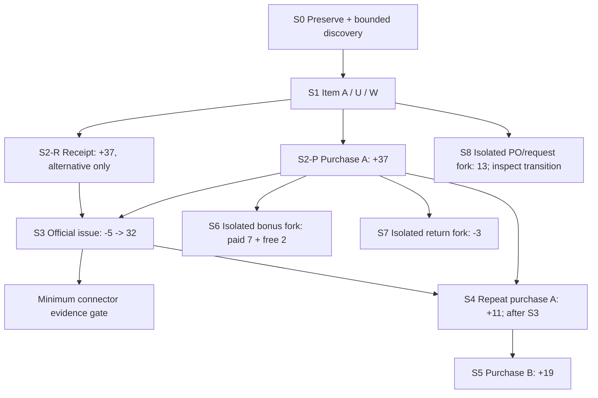

# Controlled Motakamel Dataset #001 — Design Only

Date: 2026-09-10

Pilot: #001 — Purchase Attention + Item Intelligence

Environment: `DBL-MotakamelPlus-Lab` only

Decision: **DESIGN READY FOR BOUNDED UI DISCOVERY; TRANSACTION ENTRY NOT YET READY**

This document proposes nine scenarios, S0–S8. Only S0–S3 form the minimum initial sequence: baseline/discovery, one item, one inbound event, and one outgoing event. S2 has two mutually exclusive acquisition routes, not two transactions. S4–S8 are optional extensions. No scenario has been executed by this task, and no new semantic mapping is LAB-PROVEN yet.

## 1. Objective and authority

Create the fewest official Motakamel transactions that establish an identifiable item, a known quantity in a known unit/location, an identifiable inbound event and a subsequent outgoing event. Where the official inbound workflow proves a purchase and supplier relationship, retain those additional facts. Use this evidence to authorize only the connector slice it actually supports.

Evidence sequence:

`Predeclared UI action and expected result -> bounded before evidence -> official action -> bounded after evidence -> mapping hypothesis -> independent Motakamel reconciliation -> scoped confidence decision`

Qualification levels remain separate:

- **LAB-PROVEN:** controlled official transactions reconcile with structured source evidence in the exact educational profile.
- **PARTNER-VALIDATED:** those mappings survive representative authorized Motakamel data and workflows for the partner's exact profile.
- **PILOT-QUALIFIED:** the supported experience additionally meets operational, security, provenance, failure/cleanup and user-value criteria.

The accepted [Controlled Dataset to Design Partner Strategy](https://github.com/elias-mujally/dbl-products-memory/blob/1629226fbbebb3f4e79d6b9c6fa4a3629ad7daad/products/legacy-intelligence/CONTROLLED_DATASET_TO_DESIGN_PARTNER_STRATEGY_2026-09-10.md) changes the earlier requirement to obtain representative data before all connector implementation. It does not qualify any current mapping or weaken semantic proof. The representative-data-first wording in the September 6 contract/review/README and the local September 7 evidence plan is historical sequencing where it conflicts with this strategy. Their proof and safety requirements remain useful. Existing files are not rewritten by this plan.

Planning sources read from Product Memory at remote commit `1629226fbbebb3f4e79d6b9c6fa4a3629ad7daad`:

- `PILOT_LEARNING_CONTRACT_001_PURCHASE_ATTENTION_ITEM_INTELLIGENCE_2026-09-06.md`
- `CONTROLLED_DATASET_TO_DESIGN_PARTNER_STRATEGY_2026-09-10.md`
- `MOTAKAMEL_PLUS_PROGRESS_CHECKPOINT_2026-09-03.md`
- `INDEPENDENT_FULL_PRODUCT_REVIEW_2026-09-06.md`
- `MULTI_LENS_PRODUCT_DIRECTION_2026-09-06.md`
- current `README.md` and `AI_HANDOFF.md` (their older execution instructions do not override September 10).

## 2. Existing evidence constraints and the smallest-workflow question

### What existing evidence establishes

The local investigation workspace is `C:/Users/user/Documents/Codex/2026-08-25/files-pasted-by-the-user-dbl`. The following are evidence locators, not new runtime observations:

| Evidence | Supported conclusion | Limit |
|---|---|---|
| `outputs/motakamel-v1-golden-01/GUI_POSTLOGIN_20260903_1535.md` | Main UI was reached; inventory and purchases navigation existed | Exact item, supplier, receipt and issue entry paths were not qualified |
| `MOTAKAMEL_PLUS_V1_TARGETED_GOLDEN_DATASET_QUALIFICATION.md` | At B0, item/inventory/document candidates were empty; customer creation was rejected for a missing account | Item, opening inventory and purchase/inventory event creation were not attempted/proven; old counts are not today's baseline |
| `MOTAKAMEL_CHART_OF_ACCOUNTS_TEMPLATE_PROVISIONING_QUALIFICATION.md` | Official template created 225 Account and 225 Account_Cur_Detail rows | Does not prove supplier or item prerequisites are satisfied |
| `MOTAKAMEL_ACCOUNT_NUMBERING_RULE_EVIDENCE_QUALIFICATION.md` | A numbering option was changed through the UI; no child account was saved | No post-test SQL fingerprint; do not assume the current state is identical to M7/B0 |
| `outputs/motakamel-v1-boundary-inventory-01/16-selected-local-object-columns.json` and `19-bounded-reader-results.json` | `item_detail.i_code/i_a_name`, `item_store`, `opn_stock`, `item_detail_Dtl` are captured local candidates; item code/name SQL type shown as nvarchar | The selected metadata does not specify code/name length; no proven UI length/character rule, populated stock authority or UOM mapping |
| `MOTAKAMEL_PLUS_V1_DATABASE_BOUNDARY_QUALIFICATION.md` | Local reference and candidate reads succeeded; Units_types probe returned a capped three rows | Neither unit meaning nor all prerequisites follow from counts/names; B0 later counted 14 Units_types rows |
| `MOTAKAMEL_PLUS_READONLY_ACCESS_ISOLATION_RECORD.md` and `MOTAKAMEL_PLUS_BACKUP_RESTORE_SNAPSHOT_QUALIFICATION.md` | Independent object-level read access and frozen single-database acquisition were qualified within lab limits | Reverify the exact new allowlist/profile; live READ COMMITTED is not a multi-query snapshot |

The saved GUI reports were inspected. No standalone Motakamel screenshot image was found in the inspected workspace image inventory; screenshots mentioned in reports are not treated as newly visually verified. AlMuhaseb1 screenshots and schemas are not substitutes.

**Answer to the first question:** existing evidence cannot safely identify a complete official item -> supplier -> purchase/inbound workflow that avoids account prerequisites. Claiming a known executable sequence would be guessing.

The smallest proposed workflow is therefore conditional:

1. one item in an existing, understood stock unit/location;
2. **preferred S2-P:** one official purchase with Supplier A that demonstrably affects stock;
3. **alternative S2-R:** one official inventory receipt, if an ordinary purchase is blocked and a supplier-free receipt is explicitly supported;
4. one official issue of the item.

S2-R must be named an inventory receipt/inbound event. It proves neither purchase quantity nor supplier history. Do not present a receipt as a purchase or an opening balance as a purchase. If only an opening-balance workflow is accessible, record it as a separate proposal and stop before using it in this design.

### Required bounded UI discovery

S0 must resolve the item entry form, its Help/mandatory fields, an existing valid stock unit/location, and the exact receipt/purchase/issue commands. Inspect supplier entry only if S2-P genuinely needs a new supplier. Navigation may inspect labels, Help and an unsaved form; it must not save master data or click maintenance/provisioning actions. Record exact visible paths before using the runbook as an executable instruction list.

## 3. Dataset design principles

- One item, one unit and one location initially. No Customer. Supplier A only if the purchase workflow requires it.
- One named effect per saved business action. A required new supplier is a separately captured master-data transition within S2, not an invisible prerequisite.
- No opening balance plus first receipt: that would add a redundant event. Establish a trusted zero opening condition for the new item; lack of a stock row alone is not zero-stock proof.
- Use whole quantities 37 inbound and 5 outgoing to distinguish direction and transformations. Price 10 is a conditional entry value only if the form requires price/cost and its unit/currency basis is already understood.
- No silent configuration changes to force totals. Unknown tax, posting, costing, currency, account or stock settings stop that scenario.
- Official UI creates business data. Evidence SQL is SELECT/catalog reading through an independent constrained identity; no manual SQL business writes or FMMA reader.
- The application may use its existing official identity internally; that does not make it the observer/DBL identity.
- Preserve prior evidence. Prepare a current disposable checkpoint; do not blindly revert to old M7 or overwrite old evidence.
- Application working state must remain writable for official actions. Freeze a separate evidence copy for consistent reads, not the application's active working database.
- Keep the initial learning claim at facts and a clearly described supported movement class. Do not infer sales/demand, FIFO depletion of a purchase lot, stagnant stock, or universal pharmaceutical thresholds.

## 4. Identifiers and exact-value binding

Requested human-readable labels:

| Role | Proposed label | Characters | Requested short code, only if manual codes are supported |
|---|---|---:|---|
| Item A | `DBL_P001_ITEM_A` | 15 | `P001IA` |
| Supplier A | `DBL_P001_SUPPLIER_A` | 19 | `P001SA` |
| Supplier B, optional | `DBL_P001_SUPPLIER_B` | 19 | `P001SB` |

**Label/code validation is unresolved. These are proposed values, not verified valid Motakamel input.** Saved metadata establishes nvarchar candidates but not their length or UI restrictions. In S0, inspect only these actual fields' length/character constraints via Help/form behavior and the corresponding bounded saved/current metadata. If the app generates codes, keep the generated value and record the label-to-source-ID binding. Never overwrite a generated identifier or derive account numbers. No silent truncation, suffix guessing or duplicate reuse. If restrictions conflict, record a revised exact label once before S1 and check uniqueness.

No Item B is planned initially. No new unit, warehouse, customer, currency, account or item group is pre-authorized by this design.

Run bindings, resolved from the UI before any save:

- `I`: accepted unique Item A ID and exact label.
- `U`: one existing stock unit with documented quantity basis; choose a whole/base unit so test conversion is 1:1. Otherwise block this initial profile and design one unit-conversion case.
- `W`: one existing location, with actual ID, label and branch relationship recorded; never assume warehouse 1 because branch 1 is displayed.
- `A`, optional `B`: official supplier IDs, new only if needed and accessible.
- `D0`: actual allowed document date observed for this test session, written as an exact date into the expected record before SQL inspection. Do not hard-code the plan date as the transaction date.
- `D1`: requested later allowed date for S4 (next calendar day after D0 only if the test fiscal/period rules permit it); `D2` similarly for S5. Do not change Windows time, fiscal settings or backdate unrelated records to manufacture history. If distinct dates are unavailable, same-day events may test quantities/identity but cannot prove most-recent-by-date ordering without an independent tie rule.
- `C`: existing approved document currency/rate basis, if mandatory. Preserve a proven existing one-to-one rate; otherwise stop rather than configure FX. Amount display is not an initial connector requirement.
- `P`, `O`, `P2`, `P3`, `PB`, `R`, `Q`: actual system-generated document identifiers captured after each save. No invented invoice/order numbers.

These bindings make entry values exact at execution without asserting unsupported identifiers now. Record them in a short pre-entry values block; unresolved mandatory bindings mean **no save**.

## 5. Scenario dependency graph

Conceptual / proposed; edges do not imply UI paths are qualified.



S2-P and S2-R are mutually exclusive in the initial sequence. If S2-P is blocked before any purchase save, S2-R can be assessed independently. If an attempted purchase partially saves, preserve and reconcile that state; never add a receipt on top to force 37. A separately restored disposable branch may then test S2-R.

S6/S7 use an independently preserved post-S2-P baseline of 37. S8 can use post-S1 stock zero or post-S2 stock 37, but the exact starting value must be written down. Their outputs are never mixed with the S3–S5 timeline. Preserve evidence outside the checkpoint disk chain before applying a checkpoint to a disposable run.

Bonus failure blocks only Bonus display. PO/request failure blocks only that context and rules requiring knowledge of outstanding orders. Neither blocks current stock, a proven purchase or the supported issue facts. Purchase failure blocks purchase/supplier claims but may leave the narrower S2-R Item Intelligence path viable. Item/unit/stock authority failure blocks the core quantity slice.

## 6. Detailed scenario specifications

Common requirements in section 7 apply to every scenario. “LAB-PROVEN candidate” means a proposed path to proof, never an achieved result. All transaction paths below remain PARTIAL/UNKNOWN until S0 captures the exact official form and prerequisites.

### S0 — Preserve current state and discover the minimum accessible workflow

| Field | Specification |
|---|---|
| Pilot question / necessity | Can we create the chosen item and a known stock event without entering the blocked Customer account path? Prevent reuse of an incorrect historical baseline. |
| Preconditions / entities | Exact Motakamel VM/profile identified, normal authorized access, old evidence preserved. No new business entity. |
| Values / reason | Proposed checkpoint name `P001-C0-Pre-Controlled-Data`; if present, verify/reuse or choose an explicitly recorded new run suffix, never overwrite. Bind I/U/W/D0/C candidates from official controls. |
| UI path / status | Recorded main inventory and purchases navigation: PARTIAL. Specific item/supplier/receipt/issue paths: UNKNOWN. First in-app action is specified in section 12. |
| Expected before SQL | No business save. Existence/accessibility of commands, field restrictions and prerequisites can be learned, not transaction semantics. |
| Before evidence | Current checkpoint chain and app/version, disconnected network, company/year; separate baseline preservation and current bounded item/reference counts. Record prior chart/customer-type/numbering-option state as historical context, not a new task. |
| Action | Future execution: create/verify the preservation checkpoint and verified official backup through the existing lab preparation procedure; then inspect inventory navigation, item form/Help, existing U/W pickers and candidate transaction forms without saving. Keep preparation authority separate from read identity. |
| After / reconcile | A form-path/prerequisite sheet with literal labels, restrictions, generated-code behavior and permitted dates. Existing master data unchanged within checked scope; navigation/login audit changes recorded separately. |
| Source search | Only existing item/unit/location candidates and exact metadata needed to validate input. No full schema dump or 516-table fingerprint sweep. |
| Proof / not proof | Visible form/Help plus targeted metadata can establish constraints. Main-menu presence or a successful click cannot prove a save path. |
| Stop / propagation | Unknown accounting/group hierarchy, currency settings, more than one unrelated module prerequisite, unsafe confirmation or failed GUI control: stop that branch. Do not restart Account Numbering or repeat UAC/input experiments without a new hypothesis. |
| Capability status | PARTIAL; bounded discovery is ready, transaction readiness remains BLOCKED pending findings. |

### S1 — Create and reload one stock item

| Field | Specification |
|---|---|
| Pilot question / necessity | Which stable source record corresponds to Item A and its UI code/name? Required by every later case. |
| Preconditions / entities | S0 complete for item form; accepted identifier restrictions; existing understood U and W; no existing I. One item only. If an existing group/type is mandatory, its suitability must be established by Help/UI, not by numeric code. |
| Exact values / reason | Accepted `DBL_P001_ITEM_A` label and generated/accepted code bound as I; select U. No opening quantity, prices or balances unless the official item workflow makes them unavoidable and understood. Initial intended stock: 0. Distinctive label locates the saved record. |
| UI path / status | Main inventory area -> actual official item-maintenance entry captured by S0. PARTIAL to module level, UNKNOWN to save workflow today. |
| Expected before SQL | Exactly one new logical item, same identity on reopen; no stock movement. Stock report must confirm zero (or an explicit documented zero-with-no-location-row convention). |
| Before evidence / action | Capture item list/search nonexistence and bounded candidate rows; enter minimum fields, save once, close and independently find/reopen by code and label. |
| After / reconcile | Reloaded item fields plus source row(s), source keys and local unit relationship; trusted item screen and stock lookup. System-created dependent rows are allowed if attributable, not assumed to be extra items. |
| Source search | `item_detail` i_code/i_a_name and `item_detail_Dtl` are prior anchors; verify actual keys/columns, then direct dependent unit/location rows. Search only selected identifiers. |
| Proof / not proof | Reload + source row + two UI identifiers with actual key evidence. Row count +1 or similar text alone is insufficient; one item proves within-lab identity, not global uniqueness across years. |
| Stop / propagation | Save requests a new account, unknown group hierarchy, pricing/cost configuration or extra units/warehouses: cancel and record. Failure blocks all item cases. |
| Capability status | LAB-PROVEN candidate for Item identity only; NOT EXECUTED. |

### S2 — One first inbound event; prefer purchase, allow a correctly named receipt alternative

| Field | Specification |
|---|---|
| Pilot question / necessity | Can one official inbound event put 37 U of I into W, with an identifiable header/line? If it is a purchase, does it prove supplier linkage? Establish the minimum measurable stock transition. |
| Preconditions / entities | S1 and trusted zero-stock starting state. S2-P needs one supplier A only if mandated; S2-R uses no supplier only when the official receipt supports that. Existing location/U and required document settings understood. |
| Exact values / reason | I, W, U, D0; quantity 37; bonus 0; discount 0 where editable ordinary fields. If price/cost is mandatory and its basis is proven, 10 C per U (unadjusted extension 370 C). Quantity 37 distinguishes the change from defaults. Do not alter global tax/FX/cost settings. |
| UI path / status | S2-P: purchases area -> actual purchase-entry command, UNKNOWN. S2-R: inventory area -> actual normal goods-receipt command, UNKNOWN. No known saved workflow in prior evidence. |
| Expected before SQL | Stock 0 -> 37 after the official stock-effective completion. One identifiable inbound event, one I line. Only S2-P may additionally expect purchase/supplier A. Saving an invoice need not move stock: the official timing must be established first. |
| Before evidence / action | Zero-stock report and selected row baseline. If A must be created, independently capture before -> official supplier form save/reload -> after; no balances or fabricated ledger. Then capture the transaction pre-state, enter the one line and save once. Capture saved-but-not-effective state separately if the workflow has a documented second completion step. |
| After / reconcile | Reopened document P and line L, exact quantity/unit/location/date and supplier if applicable; independent stock report 37 and item movement entry. Record any app-created financial/stock document linkage. |
| Source search | Candidates `Bills`/`Bill_detail` for generic documents and `item_store` for stock; these names are not purchase mappings. Supplier object unknown. Follow actual source IDs/dependencies only; deduplicate invoice vs separate stock document. |
| Proof / not proof | Exact document/line + source keys + zero-to-37 stock reconciliation + understood eligibility/timing. Screen total, untyped c_code, a posting flag default or “+37 somewhere” do not prove purchase or supplier. |
| Stop / propagation | Supplier/receipt requires unknown account setup; transaction needs unexplained posting/costing or a broad release action; mandatory adjustments prevent a predeclared oracle: stop before save. If save succeeded but stock is unchanged, preserve it and qualify only the saved document; do not invent a balancing entry. |
| Failure / capability status | LAB-PROVEN candidate for S2-P purchase/stock facts or S2-R receipt/stock facts, explicitly labeled. Receipt alternative can unblock S3 but not S4–S7 purchase semantics. NOT EXECUTED. |

Any supplier creation within S2 is a separate captured master action with exact label/code binding A, expected one logical supplier and no inventory effect. Capture the actual supplier source object and key only after locating the UI-created record. Existing chart rows do not establish supplier-account eligibility. If no valid official supplier workflow is accessible, do not repurpose a Customer or invent an account.

### S3 — Issue 5 units through an official inventory workflow

| Field | Specification |
|---|---|
| Pilot question / necessity | How is one known outgoing movement represented and linked to I/W, and does it reduce the authoritative stock quantity? Completes the smallest useful stock-context case. |
| Preconditions / entities | Completed S2 with stock 37. Official inventory issue form and reason/destination requirements understood. Same I/U/W. No customer or sales invoice. |
| Exact values / reason | Quantity 5, I/U/W, allowed D0 or later bound execution date; cost derived from source only if required/understood; generated document O. Expected 37 - 5 = 32. Distinct quantity exposes wrong sign and double counting. |
| UI path / status | Inventory area -> official stock-issue command discovered in S0. UNKNOWN today. An unexplained request, transfer or sales form is not an equivalent. |
| Expected before SQL | One outgoing event of 5 U and current stock 32 U. Movement after P: 5 U for this demonstrated issue class. This is not proof of sales demand or of which purchased lot was consumed. |
| Before evidence / action | Preserve post-S2 source rows and stock 37; record P boundary; save one issue and reopen O. Capture any required ordinary completion step separately. |
| After / reconcile | Issue O/line, stock 32, and item movement report showing inbound 37/outbound 5 for the chosen scope. Distinguish report date precision from true event ordering. |
| Source search | Actual movement source selected from O and direct references; `V_Trans_Dtl` is an old candidate only, not a universal ledger. Compare I/location quantity projection and transaction keys; avoid counting both document and movement rows. |
| Proof / not proof | UI action + structured event direction and identity + independent stock reconciliation. A lower stock total alone or treating all positive quantities as issues is not proof. |
| Stop / propagation | Requires customer/expense account not legitimately available, new GL setup, unexplained destination or bulk posting: stop. An accessible transfer is not substituted for an issue. Unexplained stock delta blocks the movement/quantity gate. |
| Capability status | LAB-PROVEN candidate for scoped inventory/issue facts; other outgoing families remain unsupported. NOT EXECUTED. |

### S4 — Optional repeat purchase from Supplier A

| Field | Specification |
|---|---|
| Pilot question / necessity | Can a second purchase be distinguished from P, and which source date/identity selects the most recent qualifying purchase? Only needed for automatic “previous purchase” selection. |
| Preconditions / entities | Successful S2-P and S3, stock 32; same I/A/U/W; purchase-date ordering understood or explicitly under test. |
| Exact values / reason | Buy 11 U from A on approved D1, price 10 C if required, bonus/discount 0; generated P2. Quantity differs from 37 and 5. Unadjusted extension 110 C if applicable. |
| UI path / status | Same captured official purchase path as S2-P; UNKNOWN today, becomes KNOWN only after S2-P evidence. |
| Expected before SQL | 32 + 11 = 43 stock; two distinct purchases; supplier count still 1 within complete controlled history. P2 is most recent only if D1/order semantics prove it. |
| Before / action / after | Capture 32 and P history; save/reload P2 once; capture source header/line and stock 43 independently. |
| Reconciliation / source search | Purchase-history list and stock report; exact same proven source projections plus date/tie keys. |
| Proof / not proof | Two linked source documents and trusted chronological selection. Larger document number or later insertion alone is not business-date ordering. |
| Stop / propagation | Different date requires fiscal settings or an unresolved tie cannot be discriminated: keep quantity result, block “latest” claim. S3 remains usable. S5 may run without S4 only under its explicitly recalculated starting stock, never with the 62 oracle. |
| Capability status | DEFERRED from minimum; LAB-PROVEN candidate for repeat purchase/order selection after execution. |

### S5 — Optional purchase from Supplier B

| Field | Specification |
|---|---|
| Pilot question / necessity | Does changing supplier preserve item identity and expose actual item-to-supplier history? Required only for multi-supplier/count/latest-supplier output. |
| Preconditions / entities | Preferred branch S4 with stock 43; Supplier B creation is accessible by already qualified supplier workflow. One new supplier, same item/unit/location. |
| Exact values / reason | Accepted `DBL_P001_SUPPLIER_B`, actual ID B; purchase 19 U on approved D2, price 10 C if mandatory, bonus/discount 0; generated P3. Supplier is the semantic variable; unusual quantity identifies the line. |
| UI path / status | Supplier and purchase paths proven by S2-P first; UNKNOWN today. |
| Expected before SQL | 43 + 19 = 62; same I; two distinct suppliers in controlled purchase history; B latest only if date/tie rules prove it. If run directly after S3 without S4, predeclare 32 + 19 = 51 instead and do not claim the omitted repeat-same-supplier test. |
| Before / action / after | Capture supplier baseline; create/reload only B as a separate master transition with zero stock delta; then independently capture/save/reload P3 and stock after. |
| Reconcile / source search | Exact purchase headers, supplier picker/history and stock; follow already evidenced supplier key, never supplier name matching as join. |
| Proof / not proof | UI-selected B and source-key change at the same I across documents, independent history count within declared dataset. Different labels alone do not establish two suppliers. |
| Stop / propagation | B needs additional account hierarchy/settings: defer. Does not block S0–S4. |
| Capability status | DEFERRED from minimum; LAB-PROVEN candidate for controlled supplier history only. |

### S6 — Optional bonus on a separate disposable branch

| Field | Specification |
|---|---|
| Pilot question / necessity | Does official purchase bonus mean additional physical quantity, a separate free line or a financial adjustment, and how is it linked? Needed only for Bonus display. |
| Preconditions / entities | Independent post-S2-P stock 37 branch, same I/A/U/W; official Help/form explicitly supports free stock quantity. No new bonus scheme or price structure. |
| Exact values / reason | Paid quantity 7, explicit free quantity 2, normal price 10 C if required, allowed D0, generated PB. The two distinguishable quantities separate paid vs physical totals. |
| UI path / status | Actual purchase bonus/free-quantity field or official line mechanism; UNKNOWN. |
| Expected before SQL | Only if UI establishes “2 additional physical units”: new receipt 9 U, stock 46; paid extension 70 C before any known mandatory adjustments. If UI means a discount, this is not the same test: stop and write a revised oracle before any SQL inspection. |
| Before / action / after | Capture stock 37 and no PB; save/reload one bonus purchase; capture separate paid/free fields/lines, identities, stock 46 and report. |
| Reconcile / source search | Purchase detail plus stock/movement; `Bill_detail.free_qty/free_sqty/gr_flag` and `item_detail.fre_prc` are unproven old anchors only. Discover actual representation and avoid double counting free units. |
| Proof / not proof | Exact free-quantity UI intent + related structured source quantity + physical delta 9. Zero price, field name or discount value alone is insufficient. |
| Stop / propagation | Unknown bonus setup or ambiguity persists: defer; one discriminating no-bonus comparison may be proposed from the same baseline, not a general pricing investigation. Core, supplier history and unrelated attention facts remain available. |
| Capability status | DEFERRED; LAB-PROVEN candidate only for observed bonus mechanism. |

### S7 — Optional linked partial purchase return

| Field | Specification |
|---|---|
| Pilot question / necessity | How does returning part of a purchase affect inventory and original-document context? Adds one material correction case. Cancellation is not assumed equivalent. |
| Preconditions / entities | Independent post-S2-P branch stock 37 with original P; official linked purchase-return workflow exposed and understood. Same I/A/U/W. |
| Exact values / reason | Select original P/line through official lookup; return 3 U; keep inherited unit/price when required; allowed date on/after P; generated R. Partial quantity exposes original-vs-net distinctions. |
| UI path / status | Purchases area -> official purchase return entry, exact path UNKNOWN. No use of sales return form. |
| Expected before SQL | Stock 34; original purchased quantity 37 remains historical fact; linked return 3; net quantity attributable to this linked pair 34 if no other correction exists. This is not general lot-on-hand attribution. |
| Before / action / after | Capture original P and stock 37; save/reload one linked partial return; capture R, linkage and stock 34. |
| Reconcile / source search | Original/return screens and movement report. Return object unknown; prior `RT_BILLS` evidence does not prove this is a purchase-return table. Search by actual R/P references. |
| Proof / not proof | Official original lookup + structured relationship + correct quantity/sign/stock. Equal amounts/item names or subtracting every return from every purchase are insufficient. |
| Stop / propagation | Return is unlinked, requires unknown account/posting setup or offers only destructive cancellation: stop this case. No improvised cancellation alternative. Other branches survive; unsupported returns must be detected/excluded or reject extraction outside the supported lab profile. |
| Capability status | DEFERRED; does not block first positive-case connector, but correction support must not be claimed. |

### S8 — Optional purchase order/request lifecycle, split at each save

| Field | Specification |
|---|---|
| Pilot question / necessity | Does a real item line have an outstanding purchase order/request, and how does one official closing transition change its eligibility? Needed for PO context and any “no active order” attention reason. |
| Preconditions / entities | Independent preserved S1 or S2 state; initial stock Q0 recorded as exactly 0 or 37. Actual purchase order or purchase request meaning established; do not conflate them. Supplier A only if the chosen official form requires it. |
| Exact values / reason | I/U/W, requested quantity 13, allowed D0, generated Q; no receipt. One line, no second item. Quantity 13 is distinct from all movement tests. |
| UI path / status | Actual purchase PO/request entry and official close/cancel command: UNKNOWN. `S_Order`, `Order_detail`, `Req_whse` names are not workflow proof. |
| Expected before SQL | S8a: one saved document/line, physical on-hand Q0 unchanged; active vs draft remains unproven until UI/Help independently defines it. Reservations, expected receipts and available-to-promise are separate quantities: do not presume they remain unchanged. S8b: only a known accessible close/cancel command, same Q, terminal state and no physical stock movement; outstanding quantity becomes 0 only if that command's meaning proves it. No presumed status codes. |
| Before / action / after | Capture/save/reload S8a and source state first. Write the S8b expected transition separately before action, then close/cancel only if ordinary non-destructive semantics are clear. Capture again. Never perform both then inspect only the final state. |
| Reconcile / source search | PO/request detail plus outstanding-orders report/status view and stock; actual header/line/status source and keys discovered from Q. Record literal status labels separately from raw codes. |
| Proof / not proof | Same Q/line across a meaningful UI transition plus structured state/outstanding interpretation. Existence, nonzero quantity, old date or flag name does not prove active/open. |
| Stop / propagation | Approval hierarchy, new workflow setup, required receipt to complete, data-loss warning or unknown close command: stop S8b with S8a PARTIAL. Partial receipt is a separate future test, not silently introduced here. Core and Bonus branches survive. |
| Capability status | DEFERRED; may become PARTIAL after S8a, LAB-PROVEN only for the state transition actually evidenced. |

## 7. Lightweight evidence capture template

One evidence package per **saved action**, not per click. Use a scenario folder outside any VM disk chain that will be reverted. Store private/raw lab evidence outside Product Memory; commit summaries and safe locators only.

```text
run_id / scenario_id / parent_baseline_id / branch_id
VM, application version, company/year, DB identity, U/W scope
read identity + exact SELECT allowlist; preparation operator separately
predeclared values, expected business result, UI path and path status
before: selected rows/keys + scoped counts + stock/document comparison
action: one official command/save, exact inputs, generated IDs, visible response
after: reload + corresponding bounded rows + scoped delta
reconciliation: trusted report/screen, parameters, raw/normalized values, outcome
timestamps: action order, source business dates, acquisition/as-of, timezone
hypothesis + proof references + alternatives rejected + unresolved assumptions
capability: LAB-PROVEN candidate/PARTIAL/BLOCKED/DEFERRED; executed yes/no
artifact hashes + preservation/cleanup disposition
```

Before/after SQL observes only paused/quiescent app intervals or separately frozen evidence copies; it must not treat a live READ COMMITTED series as an atomic multi-query snapshot. Before declaring any mapping LAB-PROVEN, repeat the selected projections from the independently restored, frozen final lab copy using the constrained read identity and compare the semantic records with the action evidence. Exact keys, quantities, units and state remain in deterministic comparison; capture timestamps/format-only data remain outside it. Never suppress unknown differences.

Record a verified official backup/checkpoint at S0 and preserve the qualified final core state after S3. Optional branching requires a verified restorable parent and evidence preservation first; a full backup for every click is unnecessary. Preparation may write backup/engine metadata; SQL evidence reads must not write business data. No claim of zero physical SQL-engine mutation from SELECT.

Targeted candidate counts/checksums are change-detection aids, not complete row proof. Capture full relevant row projections for I and generated documents and exact key/constraint metadata. Initial candidates are `item_detail`, `item_detail_Dtl`, `item_store`, `opn_stock`, `Units_types`, `abranch`, and generic `Bills`/`Bill_detail` only when the saved event points there. Supplier/issue/PO objects remain unknown. Expand only via a direct key/dependency or a source query tied to that exact UI action. No full inventory, global joins or arbitrary execute permissions. Reads of views must not escape the isolated copy to live/other databases.

## 8. Reconciliation matrix and limits

All numbers below are predeclared conditional expectations, not observed Motakamel data.

| Case | Starting stock | Action | Expected ending stock in U at W | Required independent comparison |
|---|---:|---|---:|---|
| S1 | No item | Create I without opening balance | 0, if documented/reconciled | Reloaded item and zero-stock convention/report |
| S2-P or S2-R | 0 | Inbound 37 | 37 | Document line + stock/movement report |
| S3 | 37 | Official issue 5 | 32 | Issue line + current stock; scoped 37 - 5 |
| S4 | 32 | Purchase A 11 | 43 | Distinct P/P2, date/order proof + stock |
| S5 after S4 | 43 | Purchase B 19 | 62 | Stable I, two suppliers + stock |
| S6 fork | 37 | Paid 7 plus physical bonus 2 | 46 | Paid/free source relation + delta 9 |
| S7 fork | 37 | Linked purchase return 3 | 34 | Original P, R/line relationship + stock |
| S8 branch | Physical Q0 = 0 or 37 | Order/request 13 then understood close | Physical Q0 | State/outstanding context + unchanged physical stock; reservation/availability effects recorded separately |

Identity, line relationships, U/W, quantities, business dates and event eligibility must match exactly after a documented unit normalization. Display separators, trailing zeros and explicitly proven rounding may differ; do not normalize away business values. If source float representation appears, preserve it and establish rounding/precision policy from actual UI/report behavior before exposing amounts. Initial connector output can omit money.

“Movement since purchase” means scoped events after P according to a proven date/sequence boundary. It never means “these exact purchased units were consumed” without lot/allocation proof. A transfer is not consumption; a return is not demand. Same-day date-only records require an evidenced ordering tie-breaker or an explicitly inclusive-day metric, not fabricated sub-day timestamps.

A single item over a short session cannot prove high/low/stagnant movement categories or time-to-depletion. A later demo may show reconciled quantities and source context. Any attention threshold must be a visible explicitly selected lab configuration, never a pharmaceutical default or universal DBL rule. Lack of PO evidence means “PO context unsupported,” never “no active PO.”

## 9. Evidence/complexity stop rules

- No arbitrary elapsed-time budgets. Stop when a prerequisite or ambiguity exceeds the scenario's named question.
- One unknown mandatory field: inspect that field's official Help/picker and available targeted metadata. If it remains ambiguous, record it and stop before save.
- A new ledger/account hierarchy, Customer, currency setup, broad pricing scheme or more than one unrelated module prerequisite stops that branch. Do not configure an ERP company to rescue the test.
- One clear item group/type prerequisite may be assessed as a named scope decision; this plan does not authorize silently creating it. Existing numeric choices must not be guessed.
- One failed save with a meaningful validation error is evidence. Do not retry with guessed identifiers or mandatory semantics.
- If a saved action produces partial/unexpected records, preserve them and pause dependent actions. Do not repair or clean them with SQL. Return to a separately preserved state only under the recorded branch procedure.
- If a query needs broader rights/another database, stop and prove the specific dependency before changing the read boundary. No FMMA, NOLOCK or isolation-option change.
- If one controlled case supports two interpretations, propose one discriminating same-baseline comparison; do not expand into a whole dictionary/code investigation. Optional questions can instead be deferred.
- Inaccessible Bonus/PO/return leaves the core facts available with explicit unsupported-state handling. Unknown corrections within an intended extraction profile cannot be silently ignored: reject that profile/run or retain a clearly bounded positive-case lab scope.
- When expected and actual differ, record both. Change the hypothesis only after causal evidence, never rewrite the original oracle to manufacture a pass.
- A click without visible response is a control-path issue, not proof of ERP semantics. Stop repeated GUI recovery and record the exact boundary.

## 10. Minimum viable LAB-PROVEN connector slice

### MUST HAVE BEFORE FIRST CONNECTOR SLICE

Successful S0, S1, S2 and S3 with the corresponding frozen-copy read/reconciliation gate. This is **one item plus two business event documents**, with one supplier master only if S2-P requires and proves it. Document separate official completion saves if required; do not claim exactly two clicks/physical rows.

Required evidence: stable within-profile I/document/line identities, explicit U/W grain, stock authority, 0 -> 37 -> 32 reconciliation, actual event direction, understood selected state, as-of/provenance, an independent read identity and isolated frozen acquisition. Produce targeted Mapping Evidence for this subset before coding.

- **S2-P success:** candidate implementation may expose Item A, current stock, the identified purchase/quantity/supplier and the demonstrated subsequent inventory issue. Automatic latest-purchase selection needs S4; do not label the manually selected P as algorithmically proven latest across arbitrary histories.
- **S2-R success only:** candidate implementation is explicitly **Item + inventory receipt/issue context**. No purchase, supplier, bonus, PO or demand claims. This is a smaller Item Intelligence demonstration, not completion of the entire Pilot #001 contract.
- If S3 is blocked, S1 alone is an identity/access result; do not silently lower this chosen two-event demo gate. Report PARTIAL and reassess the next accessible evidence source.

### NICE TO HAVE BEFORE FIRST CONNECTOR SLICE

S4 repeat purchase from the same supplier, enabling date/identity selection evidence. S5 may extend supplier history when its master workflow is already easy. Neither is required to start the explicitly selected-document core slice.

### CAN BE ADDED AFTER CONNECTOR STARTS

S5 multiple suppliers; S6 Bonus; S7 linked purchase return; S8 PO/request. Each capability is hidden/unsupported until independently proven, mapped and reconciled. A failed optional branch does not trigger framework work.

### DEFER UNTIL DESIGN PARTNER

Configuration/version variation; representative multi-item/time-series profiles; threshold usefulness and false positives; seasonal demand; partial PO receipts and stale/reopened approval lifecycles; real transfer/adjustment mixtures; unit conversion variants; multiple warehouse/batch/expiry handling; monetary/FX/tax variants; authoritative historical supplier counts beyond the dataset; large-data performance; customer operational/security/user-value qualification.

If a deferred variant is discovered in the supposedly supported lab records, it becomes a correctness gate for those records immediately; deferral never authorizes guessing.

Before first lab implementation, use the observed slice to specify minimum canonical/contract corrections and affected P1 trust fixes. Runtime types, lifecycle cleanup, source row/byte bounds, provenance, storage forward-version handling and safe lab credential/cleanup boundaries remain required where exercised. No fix is made here. Do not encode purchases as canonical Sales to fit existing code. Production deployment security and representative performance remain additional PILOT-QUALIFIED requirements.

## 11. Deliberately removed or deferred scenarios

No initial Customer, Customer Type, account, new chart, numbering test, opening inventory transaction, second item, second warehouse, unit setup, currency setup, sales invoice, customer intelligence or Pilot #002. S4 repeat purchase and S5 supplier change are separate to keep causality visible; both may wait until after the two-event core. Bonus and return use independent branches so their corrections do not confuse that core timeline. PO/request is split at save and state transition rather than pretending “open” follows from row existence. Cancellation is not treated as equivalent to a linked purchase return.

## 12. Exact first action in Motakamel

After S0 preservation and fresh verification of the correct non-elevated VMConnect control path, bring the existing `DBL-MotakamelPlus-Lab` Motakamel main window into view. **Open the inventory-management navigation entry whose actual visible label is captured, then capture its menu without selecting Add/Save.** Inventory navigation is supported by the saved post-login report; the precise child command is not known.

If an ordinary item-master/data entry command is visibly present, open that screen and inspect its Help/fields without saving. Record its literal Arabic path, code-generation behavior, character/length constraints and mandatory unit/group/account requirements. If that child path is not identifiable, stop at the expanded menu. Do not invent `Inventory -> Inputs -> Items` as a proven path or navigate into Maintenance. Supplier and inbound exploration follows only after the item prerequisites are understood.

This discovery is the next proposed execution task. It has not been run by the current design task. No new login, GUI control or checkpoint qualification is claimed from old reports.

## 13. What NOT to do

No business transaction in this design task; no build code/Canonical Model/connector change; no README or other Product Memory edit; no manual SQL business writes; no FMMA reader; no NOLOCK; no customer/Host experimentation; no administrative backup/restore feature in DBL production by assumption; no credential recording; no guessed account numbers, source dictionary equivalence, purchase table/type codes or status flags; no universal SQL tooling, mapping DSL, generic inspector or full ERP reverse engineering.

`Bills.Bill_Type != journal.doc_type dictionary unless independently proven` remains explicit. Motakamel and AlMuhaseb1 evidence remain separate.

## 14. Self-review and final readiness decision

Self-review: one item and two events can reach the first useful bounded Item Intelligence evidence gate. No fake company, new accounting hierarchy or second item is necessary. Supplier setup is conditional and separately captured. Optional Bonus/PO/history do not become hidden blockers. S2-R is honestly labeled receipt-only. Long-term movement and commercial validity are deferred. Requested identifiers remain provisional because the stored metadata cannot verify UI restrictions. No Motakamel purchase/state meaning has been promoted from names.

**Design readiness:** READY for S0 preservation and bounded UI discovery after execution is authorized.

**Business entry readiness:** BLOCKED until the actual item/U/W and chosen transaction prerequisites are recorded.

**Current connector readiness:** NOT YET LAB-PROVEN; no execution or mapping promotion in this task.

**Current partner/pilot readiness:** NOT PARTNER-VALIDATED; NOT PILOT-QUALIFIED.

**Customer Account Numbering:** not a planned dependency and must not be resumed. It is unproven whether a supplier/item/issue prerequisite will expose another accounting dependency. If it does, stop that scenario and record the exact request; never declare the old path required merely by analogy.

**Next evidence:** the item-master form and minimum inbound/issue prerequisite sheet from the existing lab, followed by S1–S3 only if S0 establishes an accessible official workflow.

**Execution path:** controlled official lab data -> scoped LAB-PROVEN mapping -> minimum Canonical/P1 corrections -> narrow connector/Item Intelligence demo -> Design Partner -> representative challenge -> supervised pilot qualification. This document applies the September 10 strategy; it does not declare the later levels achieved.
